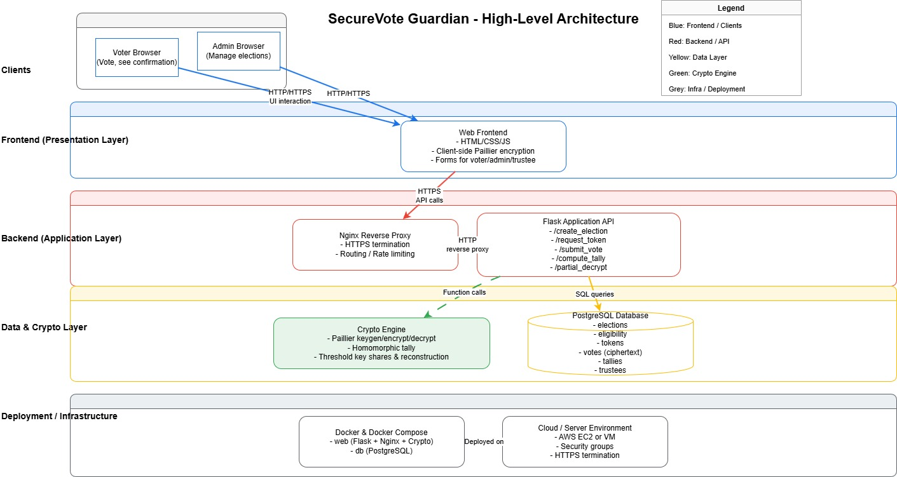
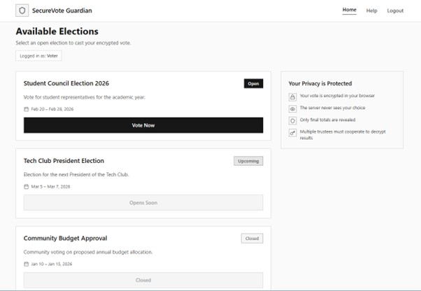
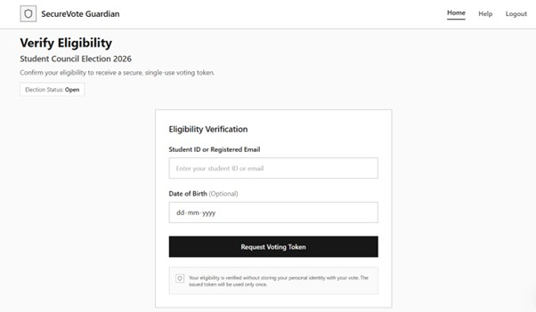
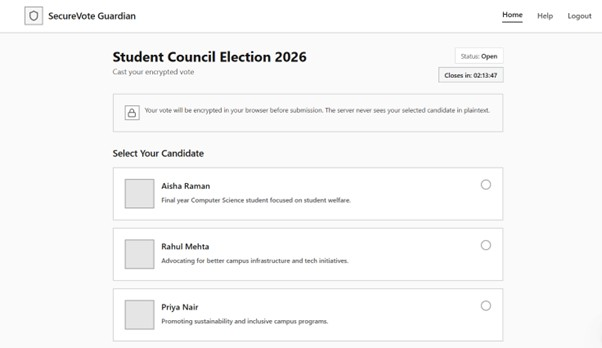
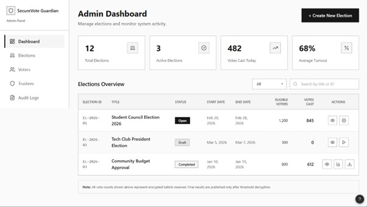
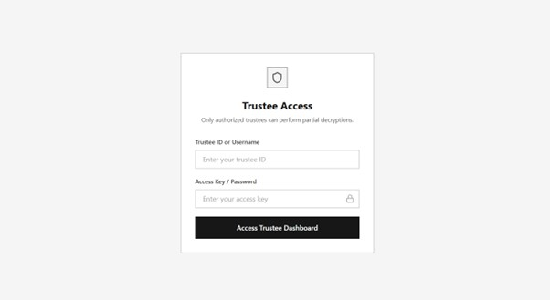
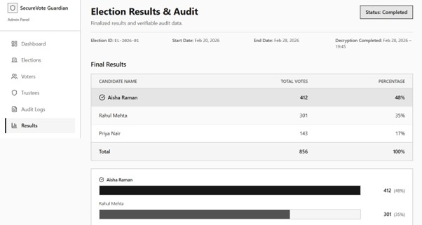

# SecureVote Guardian

**Privacy-Preserving Online Voting with Homomorphic Encryption & Threshold Cryptography**

> *Homomorphic Encryption + Threshold Crypto = Trustless Voting*

SecureVote Guardian is a cryptographically-secure web-based voting system that ensures individual ballot privacy while enabling verifiable election results. Using client-side Paillier homomorphic encryption and 3-of-5 threshold decryption, the system guarantees that no server ever sees plaintext votes, vote tallying happens on encrypted data, and only 3+ trustees can decrypt final results.

Built with pure Python cryptography and a production-ready Flask + PostgreSQL stack, it's designed for educational institutions, student elections, and small organizations (up to 10K voters).

---

## 🎯 Problem It Solves

| Traditional Solutions | Problems | SecureVote Solution |
|----------------------|----------|---------------------|
| Paper ballots | Slow counting, logistics, disputes | Fast digital counting + cryptographic proof |
| Simple web polls | Server sees votes, easy tampering | Client-side encryption, server-blind |
| Commercial e-voting | Expensive, proprietary, un-auditable | Open, transparent, student-affordable |
| Academic prototypes | Not production-ready, library-dependent | Deployable on AWS, pure Python crypto |

### Core Issues Addressed

- ❌ **Server/database compromise** → Vote privacy lost
- ❌ **Single admin controls results** → Manipulation risk
- ❌ **No verifiability** → "Trust us" problem
- ❌ **Complex crypto** → Not student-implementable

---

## 🌟 Vision

> "SecureVote Guardian transforms online voting from 'trust the server' to 'verify by cryptography' – delivering ballot-level privacy with election-level transparency through homomorphic encryption and distributed threshold decryption, accessible to every student organization."

**In 3 words:** Privacy. Verifiability. Simplicity.

---

## ✨ Key Features

### Cryptographic Foundation

- 🔐 **Client-side Paillier encryption** (pure JS/Python)
- 🔐 **Homomorphic tallying** (multiply ciphertexts → encrypted total)
- 🔐 **3-of-5 threshold decryption** (no single point of failure)
- 🔐 **Single-use voting tokens** (prevents double voting)

### User Workflows

- 👨‍💼 **Admin:** Create election → Auto-generate keys → Configure eligibility
- 👨‍🎓 **Voter:** Prove eligibility → Get token → Encrypt vote → Confirmation
- 🔐 **Trustee:** Login → Submit partial decryption → See results (3+ needed)
- 📊 **Auditor:** Export ciphertexts → Verify tally independently

### Technical Goals

- ⚡ **Scale:** 10,000 voters/election
- 🚀 **Deploy:** AWS EC2 + Nginx + PostgreSQL + HTTPS
- 📱 **Access:** Responsive web (desktop + mobile)
- 🔍 **Audit:** Complete ciphertext export + proofs

---

## 👥 Target Users

### 1.🎓Election Administrator (Primary)
- **Needs:** Easy election setup, turnout stats, verifiable results
- **Pain:** Manual vote counting, disputes over totals
- **Wants:** Simple web UI, automatic crypto setup, audit trail

### 2.👨‍🎓Voter (Primary)
- **Needs:** Vote privately from phone/laptop, 2-minute process
- **Pain:** Long queues, unclear if vote counted
- **Wants:** Simple "select candidate → submit" experience

### 3.🔐Trustee (Secondary)
- **Needs:** Submit partial decryption securely, see only their share
- **Pain:** Complex crypto ceremonies, coordination
- **Wants:** Simple web dashboard, clear instructions

### 4.📊Auditor/Verifier (Secondary)
- **Needs:** Verify no tampering occurred, publish results
- **Pain:** Cannot independently validate electronic tallies
- **Wants:** Export ciphertexts + proofs for 3rd-party check

---

## 📊 Success Metrics

| Category | Success Criteria | Target |
|----------|-----------------|--------|
| Security | No plaintext votes on server | 100% |
| Privacy | Server cannot link voter→vote | Proven |
| Scalability | Handle 10K encrypted votes | <5s tally |
| Usability | Voter completion rate | >95% |
| Verifiability | Tally matches ciphertexts | 100% |
| Deployment | AWS production-ready | Live demo |

### Academic Success

- ✅ Complete SRS (IEEE 830) + UML diagrams
- ✅ Pure Python crypto implementation
- ✅ WBS/Gantt charts (ProjectLibre)
- ✅ Live demo with 100 test voters
- ✅ Technical presentation + documentation

---

## ⚙️ Technology Stack
```
Frontend:   HTML/CSS + Vanilla JavaScript (Paillier encryption)
Backend:    Flask (Python 3.9+) + PostgreSQL 15
Crypto:     100% Pure Python (big integers, modular math)
Deployment: AWS EC2 + Nginx + HTTPS
Tools:      StarUML, ProjectLibre
```

## 🔒 Assumptions & Constraints

### Assumptions

- ✅ Voters have modern browsers + stable internet
- ✅ Trustees available post-election for decryption
- ✅ 1024-bit Paillier sufficient for student elections
- ✅ AWS-like cloud available ($20-50/month budget)
- ✅ Eligibility list provided by organizers

### Constraints

- 🔒 Pure Python crypto (NO external libraries: cryptography, gmpy2)
- 🛠️ Student team (basic-intermediate Python/Flask skills)
- 💰 Academic budget (hosting < $100 total)
- 📱 Web-only (no mobile app)

### Non-Goals (Out of Scope)

- ❌ National-scale elections (1M+ voters)
- ❌ Hardware tokens/smartcards
- ❌ Formal ZK proofs (basic verification only)
- ❌ Mobile native apps
- ❌ Real-time vote tallies (post-election only)

---

## Local Development Tools

We use the following tools for local development:

- **Python 3.12** – main language for backend and crypto.
- **Flask** – web framework for HTTP APIs and HTML views.
- **PostgreSQL 15** – relational database for elections, votes, and tallies.
- **Docker Desktop** – runs containers on the developer machine.
- **Docker Compose** – starts the Flask and PostgreSQL containers together.
- **Git & GitHub** – version control and collaboration (GitHub Flow branching).
- **VS Code / PyCharm** – recommended editors (optional).

---

## Software Design

This project follows a **layered client-server architecture** with clear separation of concerns: browser clients → Flask API → dedicated crypto engine → PostgreSQL database → Docker deployment.

### Architecture Diagrams 

[](docs/design/ArchitectureDiagram.drawio)
> Click to view interactive version in Draw.io.

**Key design decisions:**
- Crypto logic separated into dedicated modules for testability and security.
- Repository pattern for database access to reduce coupling.
- Dockerized for reproducible local development and easy deployment.

## 🖼 Wireframe Screenshots

### 🏠 Home Page


### ✅ Verification Page


### 🗳 Voting Page


### 🛠 Admin Page


### 🔐 Decryption Page


### 📊 Result Page


**Key design decisions:**
- **Layered client-server architecture** with dedicated crypto engine separated from Flask API for testability and security.
- **Repository pattern** for database access to reduce coupling between business logic and PostgreSQL schema.
- **Dockerized stack** (Flask + PostgreSQL) for reproducible local development and consistent deployment environments.
- **Mobile-first responsive UI** using CSS Grid/Flexbox for voter accessibility across desktop, tablet, and mobile browsers.
- **Progressive disclosure** in voting flow: eligibility → token → candidate selection → encryption preview → confirmation to guide users without overwhelming them.

---

⭐ **Star this repo if you find cryptographic voting interesting!**

---

**Built with ❤️ for transparent, verifiable democracy**
